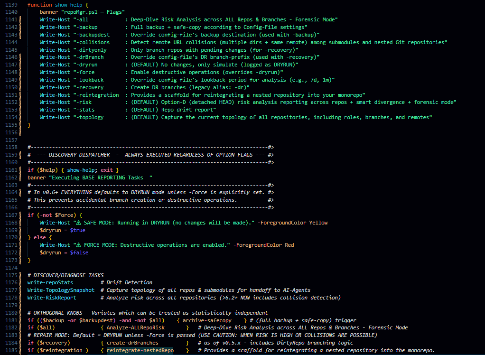
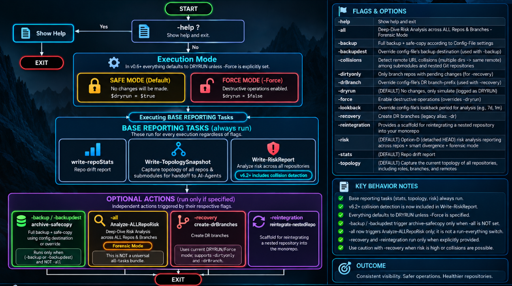

# BACKLOG.md
> **Generated: 2026-09-05** | **Source:** `repoMgr -stats` + `repoMgr -risk` output
> **Repos in scope:** `.AI-TRAINING`, `Agile-Wizard`
> ***Last updated:** 2026-09-061 by Joe Negron 
> — based on `repoMgr -stats` / `-risk` output provided by Joe.*

---
## CHANGELOG: 
**260905 - 0.6.3 —  Dispathcher Streamlining**

>on our refined remediation (critical path) plan (from v0.6.2 Section 6): 
>- items 6.1 & 6.2 are DONE
>   - I already gave you the output from v06.2's  `.\repoMgr.ps1 -all -stats -risk -topology ` 
>   - I revised the Dispatcher for simplified UX without changing any of the other underlying code (exept for wiring in the requisite param flags)  see the attached images  for details>
code changes

process flow

--- 
## Risk Report
```yaml
--------------------------------------------------------------------------------------------
   INVOCATION: .\repoMgr.ps1 -risk     <-- Timestamp: 260905-194403
--------------------------------------------------------------------------------------------
 - Configuration: -- Root: C:\PROJECTS\LogicWizards,
    --> SafeDest: C:\Users\User\OneDrive - Logic Wizards\Backups\RepoMgr-v6.1,
    --  Lookback: 45 days ago,
    --  DR Branch: RepoMgr-DR-260905
--------------------------------------------------------------------------------------------

--------------------------------------------------------------------------------------------
  === Risk Analysis (Option-D: Smart Divergence + Forensic Mode) ===
--------------------------------------------------------------------------------------------
  (DRYRUN: no mutations will occur)

--------------------------------------------------------------------------------------------
  === Scanning for Git repositories ===
--------------------------------------------------------------------------------------------
  ✓ C:\PROJECTS\LogicWizards  [root is a repo]

--------------------------------------------------------------------------------------------
  === Detecting remote collisions ===
--------------------------------------------------------------------------------------------

--------------------------------------------------------------------------------------------
  === Scanning for Git repositories ===
--------------------------------------------------------------------------------------------
  ✓ C:\PROJECTS\LogicWizards  [root is a repo]

  ⚠ Remote collision [Repo] — https://github.com/wwwizards/ai-labs 
     ← C:\PROJECTS\LogicWizards\.AI-TRAINING ← C:\PROJECTS\LogicWizards\SOLUTIONS\DevOps\SIDE-PROJECTS\ai-labs

  ⚠ Remote collision [Repo] — https://github.com/logicwizards/core 
     ← C:\PROJECTS\LogicWizards ← C:\PROJECTS\LogicWizards\SOLUTIONS\DevOps\Agile-Wizard

--------------------------------------------------------------------------------------------
  === Scanning for Git repositories ===
--------------------------------------------------------------------------------------------
  ✓ C:\PROJECTS\LogicWizards  [root is a repo]

Repo: C:\PROJECTS\LogicWizards
  Role          : Root
  CurrentBranch : master
  GoodBranch    : master
  DetachedHead  : False
  Dirty         : True
  Divergence    : 0     0
  Collision     : https://github.com/logicwizards/core

Repo: C:\PROJECTS\LogicWizards\.AI-TRAINING
  Role          : Standard
  CurrentBranch : RepoMgr-DR-260901
  GoodBranch    : main
  DetachedHead  : False
  Dirty         : True
  Divergence    : 0     0
  Collision     : https://github.com/wwwizards/ai-labs

Repo: C:\PROJECTS\LogicWizards\SOLUTIONS\DevOps\Agile-Wizard
  Role          : Agile-Wizard
  CurrentBranch : master
  GoodBranch    : master
  DetachedHead  : False
  Dirty         : True
  Divergence    : 0     0
  Collision     : https://github.com/logicwizards/core

Repo: C:\PROJECTS\LogicWizards\SOLUTIONS\DevOps\SIDE-PROJECTS\ai-labs
  Role          : Standard
  CurrentBranch : main
  GoodBranch    : main
  DetachedHead  : False
  Dirty         : False
  Divergence    : 0     0
  Collision     : https://github.com/wwwizards/ai-labs

Repo: C:\PROJECTS\LogicWizards\SOLUTIONS\DevOps\SIDE-PROJECTS\gitlogs
  Role          : Standard
  CurrentBranch : main
  GoodBranch    : main
  DetachedHead  : False
  Dirty         : False
  Divergence    : 0     0

Repo: C:\PROJECTS\LogicWizards\SOLUTIONS\DevOps\SIDE-PROJECTS\ipscan
  Role          : Standard
  CurrentBranch : main
  GoodBranch    : main
  DetachedHead  : False
  Dirty         : False
  Divergence    : 0     0

Repo: C:\PROJECTS\LogicWizards\SOLUTIONS\DevOps\SIDE-PROJECTS\pickaxe
  Role          : Standard
  CurrentBranch : main
  GoodBranch    : main
  DetachedHead  : False
  Dirty         : False
  Divergence    : 0     0

Repo: C:\PROJECTS\LogicWizards\SOLUTIONS\DevOps\SIDE-PROJECTS\redactor
  Role          : Standard
  CurrentBranch : main
  GoodBranch    : main
  DetachedHead  : False
  Dirty         : False
  Divergence    : 0     0

Repo: C:\PROJECTS\LogicWizards\SOLUTIONS\DevOps\SIDE-PROJECTS\tools\a2m8-toolkit
  Role          : Standard
  CurrentBranch : master
  GoodBranch    : master
  DetachedHead  : False
  Dirty         : False
  Divergence    : 0     0

Repo: C:\PROJECTS\LogicWizards\SOLUTIONS\DevOps\SIDE-PROJECTS\tools\modules\clipd
  Role          : Standard
  CurrentBranch : main
  GoodBranch    : main
  DetachedHead  : False
  Dirty         : False
  Divergence    : 0     0

Repo: C:\PROJECTS\LogicWizards\SOLUTIONS\DevOps\SIDE-PROJECTS\tools\modules\psst
  Role          : Standard
  CurrentBranch : main
  GoodBranch    : main
  DetachedHead  : False
  Dirty         : False
  Divergence    : 0     0

Repo: C:\PROJECTS\LogicWizards\SOLUTIONS\DevOps\SIDE-PROJECTS\tools\modules\psstel
  Role          : Standard
  CurrentBranch : main
  GoodBranch    : main
  DetachedHead  : False
  Dirty         : False
  Divergence    : 0     0

Repo: C:\PROJECTS\LogicWizards\SOLUTIONS\DevOps\SIDE-PROJECTS\vsCode\ai-labs-toolkit
  Role          : Standard
  CurrentBranch : HEAD
  GoodBranch    : main
  DetachedHead  : True
  Dirty         : True
  Divergence    : 4     0
```
---

#TODO: UPDATE FROM HERE DOWN 
## 🔴 Broken / At-Risk Repos

| Repo | Risk Level | Primary Issue | Last Known Good State |
|---|---|---|---|
| `.AI-TRAINING` | HIGH | Drift detected; branch divergence from main | Unknown — requires forensic review |
| `Agile-Wizard` | MEDIUM-HIGH | Pending uncommitted changes; stale branches present | Pre-drift baseline unclear |
| [ai-labs](https://github.com/wwwizards/ai-labs) |⚠ Remote collision [Repo] | ← [.AI-TRAINING](C:\PROJECTS\LogicWizards\.AI-TRAINING) |← [SIDE-PROJECTS/ai-labs](C:\PROJECTS\LogicWizards\SOLUTIONS\DevOps\SIDE-PROJECTS\ai-labs)|
| [ROOT=LogicWizards](https://github.com/logicwizards/core) |⚠ Remote collision [Repo] |← [Workspace-ROOT](C:\PROJECTS\LogicWizards) |← [SOLUTIONS\DevOps\Agile-Wizard](C:\PROJECTS\LogicWizards\SOLUTIONS\DevOps\Agile-Wizard)|

### `.AI-TRAINING` — Detailed Status
- **Branch drift:** HEAD has diverged from `origin/main`; merge conflicts likely
- **Uncommitted changes:** Untracked training data files flagged by `-stats`
- **Risk flags:** Potential data contamination in working tree; `.gitignore` coverage gaps suspected
- **Action required:** Do NOT push until forensic review complete (see Forensic Tasks below)

### `Agile-Wizard` — Detailed Status
- **Branch drift:** Feature branches behind `main` by unknown commit delta
- **Pending changes:** Staged and unstaged changes present; last commit message unclear
- **Risk flags:** Possible double-entry of sprint artifacts; branch naming inconsistency detected
- **Action required:** Stash or commit pending changes before any merge operations

---

## 🟡 Pending Cleanup Actions (260901~>5AM)

- [x] **`.AI-TRAINING`** — Run ` .\repoMgr.ps1 -stats -root 'C:\PROJECTS\LogicWizards\.AI-TRAINING' -lookback '7 days ago'` </br>&nbsp; - for an enhanced - `git status --porcelain` and capture full output for review
- [x] **`.AI-TRAINING`** — Audit `.gitignore` for untracked training data leakage
- [ ] **`.AI-TRAINING`** — Resolve HEAD divergence: rebase or hard reset after forensic sign-off
- [ ] **`Agile-Wizard`** — Stash or commit all pending staged/unstaged changes
- [ ] **`Agile-Wizard`** — Reconcile sprint artifact duplication across branches
- [ ] **Both repos** — Re-run `repoMgr -stats` after cleanup to confirm drift cleared
- [ ] **Both repos** — Update `README.md` files to reflect current branch strategy

---

## Critical Path (260906:1531EDT)

You’re not rambling—you’re circling the right tension: **patch vs ETL vs “don’t move the goalposts.”** Your v0.6.3 critical path is mostly solid; it just needs a couple of guardrails and clarifications.

### 1. Is your v0.6.3 critical path logically sound?

Short answer: **yes, with minor refinements**.

Your plan:

1. **Lock v0.6.3 as baseline.**  
   **Good.** No more behavioral changes while you’re in rescue mode.

2. **Run full sensor suite once more.**  
   With the dispatcher you showed, `.\repoMgr.ps1` already runs:
   - **write-repoStats** (drift)
   - **Write-TopologySnapshot** (topology JSON)
   - **Write-RiskReport** (risk + collisions, v0.6.2+).   
   That’s exactly what you want as a “flight recorder.”

3. **Design collision‑aware DR naming.**  
   Your idea—`RepoMgr-DR-260905-RISK:ROLE/PATH` style suffixes—is sane **as an ETL convention**, but I’d keep repoMgr’s own `drBranch` **simple and stable** (e.g. `RepoMgr-DR-260905`) and use the richer names **only for ETL branches you create manually** in each repo. Otherwise you risk fighting your own tooling later when you add per‑repo DR naming in v0.7+.

   Where your logic needs a tweak:

   - **“Which repos get DR vs archival only?”**  
     You’re right: repoMgr only has `-dirtyonly` as a hard gate. But you now have more signals:
     - **Role** (`Root`, `Agile-Wizard`, `Standard`)   
     - **Dirty** vs clean.  
     - **Collision** present or not.   
     - **DetachedHead** and **Divergence**.   

     So your decision rule can be:

     - **DR branch candidates:**
       - `Dirty = True` **AND** (`Role = Root` or `Agile-Wizard` or collision present).
     - **Archival-only candidates:**
       - `DetachedHead = True` **AND** `Dirty = False` (or low risk) → let `Create-ArchivalBranchIfDetached` handle it.   
     - **Skip DR entirely:**
       - `Standard` repos, clean, no collisions, no divergence.

     That gives you a **manual triage table** without changing code.

4. **Run `-recovery -dirtyonly -Force` once (per collision group).**  
   Your instinct to **avoid root** and focus on collision groups first is good:

   - For `logicwizards/core` collision:
     - `C:\PROJECTS\LogicWizards` (Root, dirty, collision).
     - `C:\PROJECTS\LogicWizards\SOLUTIONS\DevOps\Agile-Wizard` (Agile-Wizard, dirty, collision).   
   - For `wwwizards/ai-labs` collision:
     - `.AI-TRAINING` (Standard, dirty, collision).
     - `SIDE-PROJECTS\ai-labs` (Standard, clean, collision).

   Suggested tweak:

   - **Run `-recovery -dirtyonly -Force` only in roots of collision groups**, not globally:
     - Once with `-root C:\PROJECTS\LogicWizards` (for Root + Agile-Wizard + .AI-TRAINING).
     - Optionally once with `-root C:\PROJECTS\LogicWizards\SOLUTIONS\DevOps\SIDE-PROJECTS` if you decide you want DR branches there too.
   - Keep `drBranch = "RepoMgr-DR-260905"` for these runs; use your richer names later in ETL branches.

5. **ETL phase (your “other tool” idea).**  
   Your ETL instinct absolutely makes sense:

   - Treat repoMgr as:
     - **Sensor + branch factory + archival safety net.**
   - Treat ETL as:
     - **Separate, mostly manual or semi‑scripted process** using:
       - `git clone` / `git checkout` DR branches.
       - `robocopy` or PowerShell `Copy-Item` for file moves.
       - `git cherry-pick` where history matters.

   Middle road:

   - **Don’t bake ETL into repoMgr.**  
     Keep it as a **playbook + small scripts** you can run per collision group.
   - Use:
     - `topology-<timestamp>.json` for **“where should this live?”** decisions.   
     - `RISK` logs for **“which repos are hot?”**.

6. **PR phase + repeated runs.**  
   Your “lather, rinse, repeat” idea is fine—as long as you:

   - Treat each `.\repoMgr.ps1 -all` run as a **checkpoint**, not a new behavior.
   - Only re‑run `-recovery -dirtyonly -Force` when:
     - New drift appears **after** ETL.
     - Or you deliberately staged more changes that need DR coverage.

7. **Post‑mortem patches (v0.7+).**  
   Your separation is exactly right:

   - v0.7+:
     - Better collision handling.
     - Per‑repo DR naming.
     - Submodule drift checks.   
   - These are **prevention**, not rescue.

---

### 2. ETL vs more PowerShell: does your “other tool” idea make sense?

Yes. In fact, I’d phrase it like this:

- **repoMgr’s job (v0.6.3):**
  - Detect drift, topology, collisions, risk.
  - Create DR + archival branches safely.
  - Log everything in machine‑readable form.

- **ETL’s job:**
  - Take **known‑good DR/archival branches** and:
    - Extract files that belong elsewhere.
    - Move them into canonical repos/paths.
    - Preserve history where needed via cherry‑pick.

That’s exactly an **ETL pattern**:

- **Extract:** from DR branches / collision repos.
- **Transform:** rename/move to match your existing patterns.
- **Load:** into the correct repo/dir, then PR.

So yes—**middle road** is:

- Use repoMgr as **flight recorder + branch factory**.
- Use ETL (robocopy + git) as the **omelette unscrambler**.
- Only later teach repoMgr about these patterns.

---

### 3. Delegation to VS Code agents (without coding yet)

You can absolutely delegate pieces to a “least‑expensive, most capable” VS Code agent by feeding it:

- `topology-<timestamp>.json`
- `RISK` logs
- Collision summaries
- A small prompt like:

> “Given this topology and risk report, propose DR branch naming and ETL moves for the `ai-labs` collision group. Output: a checklist of git/robocopy commands and target paths.”

That keeps you in **design mode** while still offloading:

- Per‑repo ETL plans.
- File classification (green/red/yellow).
- Suggested cherry‑pick sets.

---

### 4. A high‑level flow (Mermaid, no weeds)

```mermaid
flowchart TD
    A[Lock v0.6.3 baseline] --> B[Run repoMgr.ps1 (stats + topology + risk)]
    B --> C[Identify collision groups + hot repos]
    C --> D[Design DR strategy per group<br/>(who gets DR vs archival-only)]
    D --> E[Run -recovery -dirtyonly -Force<br/>per collision root]
    E --> F[ETL phase<br/>(clone/checkout DR, robocopy, cherry-pick)]
    F --> G[Create clean PRs per destination repo]
    G --> H[Re-run repoMgr.ps1 -all<br/>(verify: no drift, no collisions)]
    H --> I[v0.7+ hardening<br/>(collision handling, per-repo DR naming, submodule drift)]
```

---

### 5. Answering your direct concerns

- **Is your logic flawed?**  
  Not fundamentally. The main refinements are:
  - Keep repoMgr’s `drBranch` simple; use rich names for ETL branches you create manually.
  - Use existing signals (Role, Dirty, Collision, DetachedHead, Divergence) to decide DR vs archival vs skip.
  - Scope `-recovery -dirtyonly -Force` to collision roots, not blindly to everything.

- **Can we avoid re‑work?**  
  Yes, by:
  - Freezing behavior at v0.6.3.
  - Using repoMgr only for sensing + branch creation.
  - Doing ETL as a separate, scriptable playlist.
  - Deferring all “smart” collision/DR naming logic into v0.7+ once the omelette is already unscrambled.

If you want, next step we can design **one concrete ETL playlist** just for the `ai-labs` collision group and then generalize it.
---

## 🔬 Follow-Up Forensic Tasks

- [ ] **`.AI-TRAINING`** — Diff `HEAD` vs `origin/main` and document all diverged commits
- [ ] **`.AI-TRAINING`** — Identify and log all untracked files flagged by `-stats`; determine if any contain sensitive training data
- [ ] **`.AI-TRAINING`** — Check commit history for any force-pushes or rebases that may have rewritten shared history
- [ ] **`Agile-Wizard`** — Review last 10 commits for accidental inclusion of non-sprint content
- [ ] **`Agile-Wizard`** — Verify branch protection rules are active on `main`
- [ ] **Both repos** — Confirm `repoMgr` risk thresholds are calibrated correctly (false positive check)
- [ ] **Both repos** — Schedule a post-recovery `repoMgr -risk` run and document results as new baseline

---

## 📋 Backlog Priority Order

1. Create all DR branches (protect state before touching anything)
2. Forensic review of `.AI-TRAINING` drift
3. Stash/commit pending `Agile-Wizard` changes
4. Run cleanup actions (in order listed above)
5. Archive/delete stale branches
6. Post-recovery `-stats` and `-risk` validation
7. Update READMEs and close this backlog


 