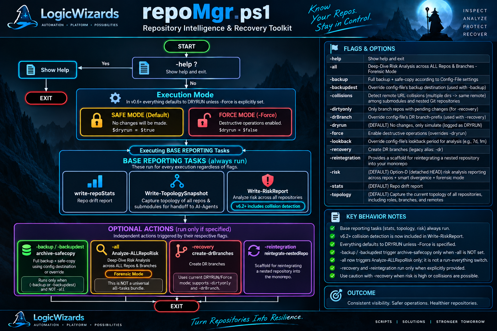

<#--------------------------------------------------------------------------
#  SCRIPT: CHANGELOG.md — repoMgr release history
#--------------------------------------------------------------------------
# PURPOSE:  Release log for repoMgr, documenting version milestones and fixes.
# ABSTRACT: Tracks the evolution of repoMgr from initial port through the
#           current v0.6.3 dispatcher-safe reporting flow.
# REQUIRES: Git, PowerShell 7+, and repository context.
# CREATED:  260827 BY: Joe Negron (LogicWizards.NYC)
# UPDATED:  260910 BY: Copilot (Docs sync: reverse-chronological ordering + latest entry)
# COMPANY:  LogicWizards.NYC <LogicWizards.NYC>
# VERSION:  0.6.3 - current release baseline for README/CHANGELOG synchronization
# LICENSE:  AGPL-3.0 <https://www.gnu.org/licenses/agpl-3.0.html>
# NOTES:  Use in conjunction with README.md and the Git forensics notes.
#--------------------------------------------------------------------------#>

| Related docs | Purpose |
| --- | --- |
| [README.md](README.md) | Current usage, configuration, and operational overview. |
| [BACKLOG-v0.6.3.md](BACKLOG-v0.6.3.md) | Active backlog, workflow notes, and dispatcher/UX rationale. |
| [advanced-git-recovery-commands.md](advanced-git-recovery-commands.md) | Git forensics and recovery command reference. |

---
##     **260914 - 0.6.4.x** - Mission alignment + live baseline evidence: validation-first refactor prep while preserving live discovery, recovery, and triage work.
* **(DOC)** Reframed the repo roadmap and README around the current mission: stabilize repoMgr without rerailing the active recovery/discovery effort.
* **(DOC)** Clarified that the refactor must preserve topology, remote-collision detection, DR safety, and dry-run-first reporting while the broader triage workflow continues.
* **(DOC)** Added the confirmed 260914 live baseline facts: DRYRUN execution, root repo on `DEV`, `.AI-TRAINING` on `RepoMgr-DR-260901`, and active `repoMgr-logs` / `topology-*.json` artifact generation.
* **(TEST)** Refreshed the validation suite wording to match the current recovery/discovery mission and the safer reporting baseline.

---
##     **260910 - 0.6.3** - Documentation refresh: README and changelog synced to the current repoMgr.ps1 behavior, dispatcher flow, and safe dry-run defaults.
* **(DOC)** Updated usage guidance to reflect `-stats`, `-topology`, `-risk`, `-collisions`, and `-Force` behavior.
* **(DOC)** Added related-docs table linking to the changelog, backlog, and advanced Git recovery commands.
* **(DOC)** Reordered the release log from newest to oldest for easier operational reference.

---
##     **260905 - 0.6.3** - Dispatcher streamlining and UX cleanup.
* **(MOD)** Simplified the dispatcher while preserving the underlying repo reporting flow.
* **(UX)** Kept the operational baseline focused on safe reporting and dry-run-first behavior.

---
##     **260905 - 0.6.2** - Patch release

* **(FIX)** Normalize-RemoteUrl: strip trailing .git, normalize host/path case, support HTTP(S) and SSH forms.
* **(FIX)** Get-RemoteCollisions: normalize .gitmodules and nested repo remotes before grouping; log REMOTE-COLLISION events.
* **(FIX)** Analyze-AllRepoRisk: safe divergence compare ref when HEAD is detached; avoid misleading rev-list errors.
* **(FIX)** Dry-run/Force semantics: Write-RiskReport and Create-ArchivalBranchIfDetached respect DRYRUN and -Force consistently.
* **(MOD)** Write-TopologySnapshot: include OriginUrl and write topology JSON to repoMgr-logs/topology-<timestamp>.json.
* **(UX)** Improved logging: DRYRUN banners, idempotent DR branch guards, quieter repeated-run output.
* **(TEST)** Defensive checks: include $root in get-repoList when it is a repo; guard missing remote outputs.

---
##     **260904 - 0.6.1** -  minor UX improvements and tweaks.

---
##     **260903 - 0.6.0** -  multiple improvements and new features added.
* **(ADD)** Added dry-run support for create-drBranches: prints planned actions without executing them.
* **(BUG)** fixed: now restores the pointer to the original branch after creating DR branch.
* **(ADD)** new functions for repository topology and risk analysis.
     * (NEW) FUNCTION: Get-RemoteCollisions - Detects remote URL collisions (multiple dirs → same remote) among submodules and nested Git repositories.
     * (NEW) FUNCTION: Write-TopologySnapshot - Captures the current topology of all repositories, including roles, branches, and remotes.
     * (NEW) FUNCTION: Write-RiskReport - Generates a risk analysis report for all repositories, including remote collisions.
     * (NEW) MVx-FUNCTION: analyze-fileOverlap - Detects overlapping file changes between two branches by comparing the last modification dates of each file.
* **(ADD)** dry-run support for create-drBranches and ensured original branch is restored after DR branch creation.
* **(MOD)** -all now includes -topology and -collisions as well.
* **(MOD)** DR branch creation now requires -Force to execute, otherwise it will be skipped in dry-run mode.
* **(MOD)** Updated help information to reflect new features and changes.
* **(MOD)** Improved error handling and logging for all operations.
* **(MOD)** General code cleanup and refactoring for better maintainability and improved UX.
* **(MOD)** Updated repository analysis functions to include additional metrics and improved reporting.
* **(MOD)** Enhanced logging for repository backup and recovery operations - improved visibility into success and failure events
* **(MOD)** Improved handling of nested Git repositories and submodules for all operations - enhanced detection and management of nested structures
* **(MOD)** Agent-friendly improvements for better integration with CI/CD pipelines & AI-assisted workflows.

---
##     **260901 - 0.5.4** - Fixed three post-table bugs surfaced by -all -dryrun run:
* **(BUG)** fixed: Nested detection false-positive: parent dir scan re-flagged
        $root as nested. Added Resolve-Path equality guard.
* **(BUG)** fixed: Reintegration double-path: Join-Path $root $repo.Name
        doubled the leaf dir name. Now uses $repo.FullName + root guard.
* **(UX)**  Silent empty history: git log returning nothing left a blank
        line. Now prints "(no commits in window)" fallback.
* **(PATCH)**  Updated create-drBranches to guard against re-creating an existing DR branch.

---
##     **260901 - 0.5.3** - Added Show-PendingChanges helper: replaces flat one-liner
      with Format-Table view. Parses XY porcelain codes into
      Action/Scope/File columns. Summary count header included.
      -Grouped switch available for large dirty repos.

---
##     **260901 - 0.5.2** - Fixed three bugs:
* **(BUG)** fixed: $root shell-tokenizer quirk: -root='path' passes literal
           '-root=C:\path' string; added sanitization + guard + user warning.
* **(BUG)** fixed: Get-ChildItem -Directory cascade failure was caused entirely
           by the poisoned $root value above — no independent fix needed.
* **(DESIGN)** get-repoList never checked $root itself for .git; it only
           recursed into subdirs. Added self-check so -root targeting a
           single leaf repo (e.g. .AI-TRAINING) works correctly.

---
##     **260831 - 0.5.1** - Fixed CFG-INFO invalid variable name (renamed to $cfgInfo) causing a
script-wide ParseException, and moved the INIT log call to after the
log function definition to fix call-before-definition order.

---
##     **260830 - 0.5.0** - refactored from v0.4 for speed & efficiency on deep & wide repo-traversals:
* Smart Divergence (merge‑base bounded traversal)
* Forensic Mode (metadata‑only, JSON output)
* Archival branch detection for detached HEAD
* DR branch creation retained
* Divergence checks vs primary branch (main/master)
* Stale‑commit detection
* Destructive‑commit classification (crude but useful)
* Risk scoring with role‑sensitive thresholds (Root vs Agile‑Wizard vs Standard)
* Root + Agile‑Wizard sensitivity hooks for future tuning

---
##     **260830 - 0.4.0** - Added:
* bounded traversal via config $lookback (with override)
* automatic JSON output to repoMgr‑logs
* archival‑branch detection for detached HEAD
* DR‑branch creation (existing, now risk‑aware)
* divergence checks vs primary branch (main/master)
* stale‑commit detection
* destructive‑commit classification
* risk scoring with severity buckets
* root + Agile‑Wizard repo role awareness

---
##     **260830 - 0.3.2** - Updated version and ensured -risk option is documented.

---
##     **260828 - 0.3.x** - Added -risk option for analyzing detached HEAD state (single‑repo).

---
##     **260827 - 0.2.0** - Initial port from previous BASH version.
---