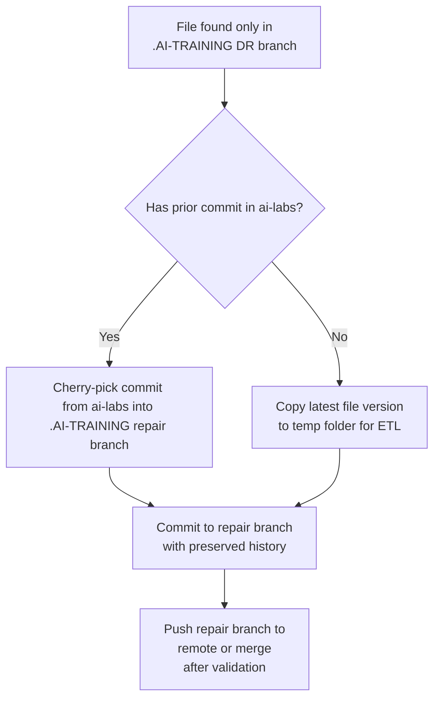
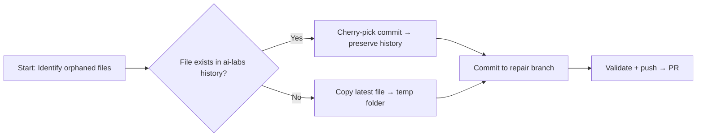

Perfect timing, Joe — you’re right on the edge of the **ETL phase**, and your logic is solid. You’ve already done the hard part: stabilizing the toolchain and capturing the full telemetry. What you need now is a **triage playlist** and a **decision diagram** that make the next moves obvious, plus a **commented sample script** that shows how to extract, transform, and load without losing history.

---

## 🧭 TRIAGE PLAYLIST — “AI‑Labs vs .AI‑Training” Collision Group

### **Goal**
Recover orphaned or misplaced files from `.AI‑TRAINING` and `ai‑labs` repos, preserving history where possible.

### **Step 1 — Snapshot & Compare**
1. **Confirm local DR branch exists**  
   ```pwsh
   git -C "C:\PROJECTS\LogicWizards\.AI-TRAINING" branch
   ```
   Expect: `RepoMgr-DR-260901` (local only).

2. **List uncommitted files**  
   ```pwsh
   git -C "C:\PROJECTS\LogicWizards\.AI-TRAINING" status --short
   ```

3. **Export file list for diffing**  
   ```pwsh
   git -C "C:\PROJECTS\LogicWizards\.AI-TRAINING" status --short > AI-TRAINING_DR_260901.txt
   git -C "C:\PROJECTS\LogicWizards\SOLUTIONS\DevOps\SIDE-PROJECTS\ai-labs" log --since="45 days ago" --oneline > AI-LABS_COMMITS.txt
   ```

4. **Compare lists manually or with PowerShell**  
   ```pwsh
   Compare-Object (Get-Content AI-TRAINING_DR_260901.txt) (Get-Content AI-LABS_COMMITS.txt)
   ```

---

### **Step 2 — Decision Tree (simplified)**



---

### **Step 3 — ETL Extraction (manual or scripted)**

#### **Option A — Preserve history (cherry-pick)**
If the file existed in `ai-labs` history:

```pwsh
# Identify commit containing the file
git -C "C:\PROJECTS\LogicWizards\SOLUTIONS\DevOps\SIDE-PROJECTS\ai-labs" log -- <filename>

# Cherry-pick into repair branch
git -C "C:\PROJECTS\LogicWizards\.AI-TRAINING" checkout -b AI-TRAINING-REPAIR-260905
git -C "C:\PROJECTS\LogicWizards\.AI-TRAINING" cherry-pick <commit-hash>
```

#### **Option B — Latest copy only (ETL move)**
If the file never existed in `ai-labs` history:

```pwsh
# Create temp folder for ETL
$src = "C:\PROJECTS\LogicWizards\.AI-TRAINING"
$dst = "C:\PROJECTS\LogicWizards\TEMP\AI-TRAINING-RECOVERY"

# Copy untracked and modified files
robocopy $src $dst /E /XF *.git* /XD repoMgr-logs

# Verify copied files
Get-ChildItem $dst -Recurse | Out-GridView
```

Then manually move or script the load phase:

```pwsh
# Move recovered files into canonical repo
robocopy $dst "C:\PROJECTS\LogicWizards\SOLUTIONS\DevOps\SIDE-PROJECTS\ai-labs" /E /XC /XN /XO
```

---

### **Step 4 — Load & Validate**
1. **Commit recovered files in destination repo**
   ```pwsh
   git add .
   git commit -m "Recovered orphaned files from .AI-TRAINING DR branch (260901)"
   git push origin main
   ```

2. **Re-run repoMgr telemetry**
   ```pwsh
   .\repoMgr.ps1 -stats -topology -risk
   ```
   Confirm:
   - No dirty repos.
   - No collisions.
   - No detached HEADs.

---

### **Step 5 — PR & Documentation**
- Create PRs per destination repo:
  - `AI-TRAINING-REPAIR-260905`
  - `AI-LABS-RECOVERY-260905`
- Attach the ETL manifest (file list + commit hashes).
- Update `BACKLOG.md` with recovery notes.

---

## 🧩 Dummied‑Down Decision Diagram (for quick triage)



---

## 🧰 Commented Sample Code (Git + Robocopy)

```pwsh
# --- ETL Extraction ---
# Define source and destination
$src = "C:\PROJECTS\LogicWizards\.AI-TRAINING"
$dst = "C:\PROJECTS\LogicWizards\TEMP\AI-TRAINING-RECOVERY"

# Copy all non-git files (extract)
robocopy $src $dst /E /XF *.git* /XD repoMgr-logs

# --- ETL Transform ---
# Optional: rename or reorganize folders
Rename-Item "$dst\HOBOTS" "HOBOTS_RECOVERED"

# --- ETL Load ---
# Move recovered files into canonical repo (load)
robocopy $dst "C:\PROJECTS\LogicWizards\SOLUTIONS\DevOps\SIDE-PROJECTS\ai-labs" /E /XC /XN /XO

# --- Git Commit ---
# Stage and commit recovered files
git -C "C:\PROJECTS\LogicWizards\SOLUTIONS\DevOps\SIDE-PROJECTS\ai-labs" add .
git -C "C:\PROJECTS\LogicWizards\SOLUTIONS\DevOps\SIDE-PROJECTS\ai-labs" commit -m "Recovered orphaned files from .AI-TRAINING DR branch (260901)"
git -C "C:\PROJECTS\LogicWizards\SOLUTIONS\DevOps\SIDE-PROJECTS\ai-labs" push origin main
```

---

### ✅ Outcome
- `.AI-TRAINING` DR branch becomes your **source of truth** for missing artifacts.
- `ai-labs` repo regains lost files and continuity.
- History preserved where possible; latest copies recovered otherwise.
- Monorepo integrity restored without rewriting repoMgr logic.

---

If you’d like, I can now draft a **Mermaid ETL flow** specifically for the `ai-labs` collision group — showing how `.AI-TRAINING` and `ai-labs` interact during extraction, transformation, and load. Would you like that visual next?