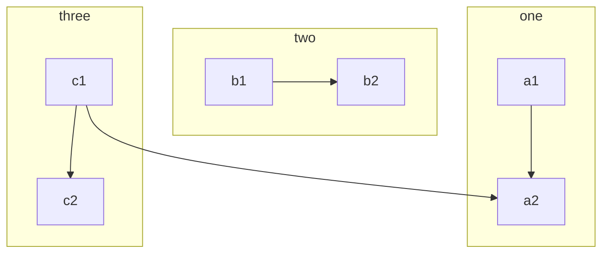
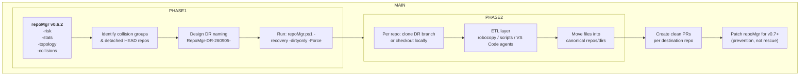

# RECOVERY‑PLAYLIST  
> **Generated: 2026-09-01** | **Source:** `repoMgr -stats` + `repoMgr -risk` output
> **Repos in scope:** `.AI-TRAINING`, `Agile-Wizard`
> ***Last updated:** 2026-09-07 by Win11-Copilot  
> — based on `REPORT-260901-00-LogicWizards.txt` "flight recorder" outputs previous run
### Attack Plan (v0.6.3+)

This version assumes our current `repoMgr.ps1` (0.6.2) with all MODs in CHANGELOG.md. 
- **RELATED:** 
  - BACKLOG-v0.6.2.md
  - repoMgr-v0.6.3-TRIAGE.PLAYBOOK.md 

---
You’re circling the real design question: *do we fix the machinery first, or use it as‑is to surgically move data where it belongs, then harden it?* Your “DR prefix + per‑repo suffix + ETL” idea absolutely makes sense, and it’s a good middle road.

From what you’ve already wired in v0.6.2:

> - *“DR branch creation now requires -Force to execute, otherwise it will be skipped in dry-run mode.”*  
> - *“Write-TopologySnapshot: include OriginUrl and write topology JSON to repoMgr-logs/topology-<timestamp>.json.”*   

**We already have enough safety rails to *use* the tool while designing the next evolution. v0.6.3+ now has the dispatcher streamlined for improved UX - as illustrated (by:GPT5).**

---

### 1. Critical path: avoid re‑work

The way to avoid patch‑churn is:

1. **Freeze semantics for this recovery episode.**
   - Treat v0.6.3 as “operationally stable” for one marathon.
   - No behavior changes to `create-drBranches` / `Write-RiskReport` until after we’ve harvested what we need.

2. **Use DR branches + ETL as the recovery vehicle, not as the long‑term pattern.**
   - Let this episode be “ETL‑style cleanup using the current toolchain”.
   - Then patch repoMgr for v0.7+ with what we learned.

3. **Patch *after* ETL, focused on prevention, not on rescuing this incident.**
   - Future patches: better collision semantics, per‑repo DR naming, submodule drift checks, etc.
   - But those are for “next time”, not for this recovery.

#### So the critical path is:

> **Design ETL + DR naming → run recovery once → then patch.**  
> (NOT: patch → run → patch again → run again...)

---

### 2. Middle road: DR naming + ETL, not more PowerShell

>**Your idea:**
>
> - USING: `drBranch = "RepoMgr-DR-260905"`  
> - then append child dir:  
> `RepoMgr-DR-260905-RISK:ROOT/.AI-TRAINING`  
> `RepoMgr-DR-260905-RISK:SIDE-PROJECTS/ai-labs`  

**Conceptually, that gives you:**

- **Per‑repo DR branches that encode:**
  - The global DR episode (`RepoMgr-DR-260905`).
  - The logical role or path (`ROOT`, `.AI-TRAINING`, `SIDE-PROJECTS/ai-labs`).
- **A natural ETL target:**
  - You can clone those branches, treat them as “source snapshots”, and move files into their canonical repos using:
    - `robocopy` (or your existing automation) for file‑level ETL.
    - `git cherry-pick` for history‑preserving moves where needed.

**The middle road looks like:**

- **Use git for history and branch isolation.**
- **Use ETL tooling (robocopy, scripts, maybe VS Code agents) for file movement and normalization.**
- **Use repoMgr only to:**
  - Discover collisions.
  - Create DR branches once.
  - Capture topology and risk JSON as “flight recorder”.

**No need to turn repoMgr into a full ETL engine—let it be the *sensor* and *branch factory*, not the surgeon.**

---

### 3. New aporiae that matter *before* `-recovery -dirtyonly -Force`

Given the current functions:

> *“Creates DR branches for all repositories, optionally only for dirty ones… Dry-run aware… Branch-safe: restores the original branch after DR creation.”*   

#### The aporiae that *do* matter  before you pull the `-Force` trigger:

---
1. **Collision awareness.**
   - You now *know* that:
     - `.AI-TRAINING` and `SIDE-PROJECTS/ai-labs` share `wwwizards/ai-labs`.
     - `ROOT` and `Agile-Wizard` share `logicwizards/core`.   
   - That means any DR branches created in those repos are *logically coupled*—they’re different views of the same remote.
   - :exclamation: So: you should **plan ETL per collision group**, not per repo in isolation :exclamation:
---

2.  **Detached HEAD in `ai-labs-toolkit`.**
    - `Analyze-AllRepoRisk` already spots it and will call `Create-ArchivalBranchIfDetached` when `-Force` is set.   
    - That’s good—but it means:
      - You’ll have `recovered-*` branches *and* `RepoMgr-DR-*` branches.
      - Your ETL plan should treat those as separate “source layers”.
---

3. **Dirty vs clean repos.**
    - `-dirtyonly` will skip clean repos, which is what you want.
    - But for collision groups, “dirty” in one repo may correspond to “clean but structurally wrong” in another.
    > - **So the only *pre‑Force* design tweaks you need are:**
    >   - **Decide DR naming convention per collision group.**
    >   - **Decide which repos in each group get DR branches vs just archival branches.**
    >   - **Decide how ETL will treat each branch (source vs destination).**
---
**No code changes required to `create-drBranches` for this run — just a naming convention and a plan.**

---

### 4. ETL‑first workflow: high‑level flow

Here’s a mermaid sketch of the middle‑road flow you’re describing:

Key points:

- **repoMgr’s job in this episode:** discover, snapshot, branch.
- **ETL’s job:** move and normalize.
- **Future repoMgr patches:** ensure we don’t end up here again.

---

### 5. Delegation to VS Code agents: cheap, focused tasks

You absolutely can delegate pieces to “most capable least expensive” VS Code agents, if you frame the tasks as small, composable prompts.

Think in terms of **micro‑deliverables**:

- **Agent Task A: Collision group classifier.**
  - Input: `topology-*.json`, `REMOTE-COLLISION` logs.
  - Output: a JSON mapping:
    - `collisionGroupId` → `{ repos: [...], remoteUrl, roleSummary }`.
  - Prompt: “Given this topology and collision log, group repos that share the same remote and label each group.”

- **Agent Task B: DR naming plan.**
  - Input: collision groups + config (`drBranch = "RepoMgr-DR-260905"`).
  - Output: table:
    - `repoPath`, `role`, `drBranchName`.
  - Prompt: “For each repo, propose a DR branch name using this prefix and role/path suffix.”

- **Agent Task C: ETL manifest per repo.**
  - Input: `RISK` JSON, `stats` output, DR branch names.
  - Output: manifest:
    - `sourceBranch`, `destinationRepo`, `filesToMove`, `movementType (copy/cherry-pick)`.
  - Prompt: “Given these branches and drift, list which files should move where, and how.”

You stay in **discovery/design mode** by:

- Having agents produce manifests, not code.
- Reviewing those manifests as your “ETL spec”.
- Only then writing minimal scripts (or even manual commands) to execute them.

---

### 6. A refined remediation plan (critical path)

Putting it together, a fast, low‑rework plan:

1. **Lock v0.6.3 as the operational baseline.**
   - [x] No more behavior changes until after this episode.

2. **Run the full sensor suite once more (already mostly done).**
   - [x] `repoMgr.ps1 -all` from root.

3. **Design collision‑aware DR naming.**
   - [x] Use your prefix + role/path suffix idea. `drBranch = "RepoMgr-v0.6.3-RECOVERY-260907"`
   - [x] Decide:
     - Which repos get DR branches.
     - Which only get archival branches.

4. **Run `-recovery -dirtyonly -Force` once.**
   - Let `create-drBranches` do its job with your naming convention.
   - Confirm branches exist per repo.

5. **ETL phase.**
   - For each collision group:
     - Clone/checkout DR branches.
     - Use robocopy / scripts to move files into canonical repos.
     - Use cherry-pick where history matters.
   - Keep this as an ETL process, not a repoMgr feature.

6. **PR phase.**
   - Create clean PRs per destination repo.
   - No cross‑repo PRs; treat each repo as its own truth.

7. **Post‑mortem patches (v0.7+).**
   - Only after ETL is complete:
     - Add better collision handling.
     - Add per‑repo DR naming support.
     - Add submodule drift checks.
   - These patches are now about *prevention*, not rescue.

That becomes your new remediation plan: **use v0.6.2 as a flight recorder + branch factory, layer ETL on top, then harden the tool once the omelette is unscrambled.**

If you want, next step we can sketch a second mermaid diagram just for the collision‑group ETL flow (ROOT/core vs AI‑TRAINING/ai‑labs) so you can see the movement without touching code yet.

---
### COMMITS
`git log -n 10  --pretty=format:"%C(#FFA500)%h%Creset %C(blue)%ad%Creset %<(110,trunc)%s" --date=iso`                                                                                                                

| hash        | timestamp                 | memo                                                                                                           |
|-------------|---------------------------|----------------------------------------------------------------------------------------------------------------|
|**00f5270**|2026-09-06 02:45:11 -0400| 260906JN: interrim commmit for tweaks & MD updates after v0.6.2 MODs|
|**47b0499**|2026-09-05 19:24:35 -0400|  0.6.2 — Patch release (remote normalization, collision detection, risk fixes) ## Summary This patch closes s..|
| **e8ddf4a** | 2026-09-05 12:47:00 -0400 | 260905JN: final remediation-plan appendix (OCD+PTSD Gap-Aanalysis) after v0.6.1 MODs - but still pre-kickoff   |
| **801c56d** | 2026-09-05 11:41:37 -0400 | 260905JN: another commmit for config file & remediation-plan alignment after v0.6.1 MODs but still pre-kickoff |
| **86af712** | 2026-09-05 11:39:23 -0400 | 260905JN: interrim commmit for config file & remediation-plan alignment after v0.6.1 MODs but still pre-kick.. |
| **0fb3a65** | 2026-09-05 10:39:46 -0400 | final commit repoMgr-v0.6.1  - after 13d unscrabmling of a bad-bot's omelette that was our monorepo - ho.. |
| **f3367ea** | 2026-09-05 05:15:40 -0400 | 260905JN: interrim commmit for tweaks after v0.6.0 MODs                                                        |
| **e52d2e4** | 2026-09-03 20:17:23 -0400 | repoMgr-v0.6.0 - after 10d of analysis on corrupted monorepo - ready to run                                    |
| **97b9a3b** | 2026-09-01 10:47:04 -0400 | 260901JN: interrim commmit for files touched after v0.5.4 MODs                                                 |
| **f6191fa** | 2026-09-01 10:27:42 -0400 | repoMgr-v0.5.4 - ready to reintegrate .AI-TRAINING... #     260901 - 0.5.2 - Fixed three bugs: #            .. |
| **8ac287f** | 2026-09-01 00:33:48 -0400 | initial commit repoMgr-v0.5.1 - after 7d of analysis on corrupted monorepo - ready to run                      |